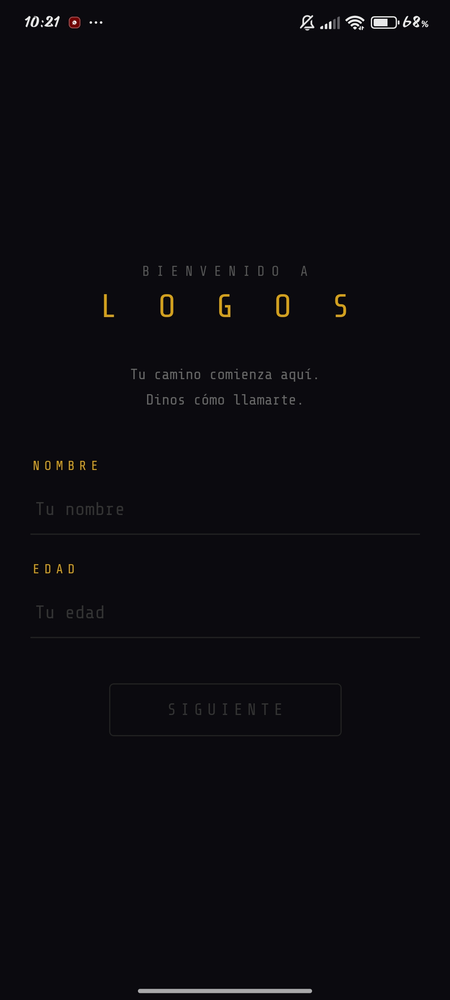
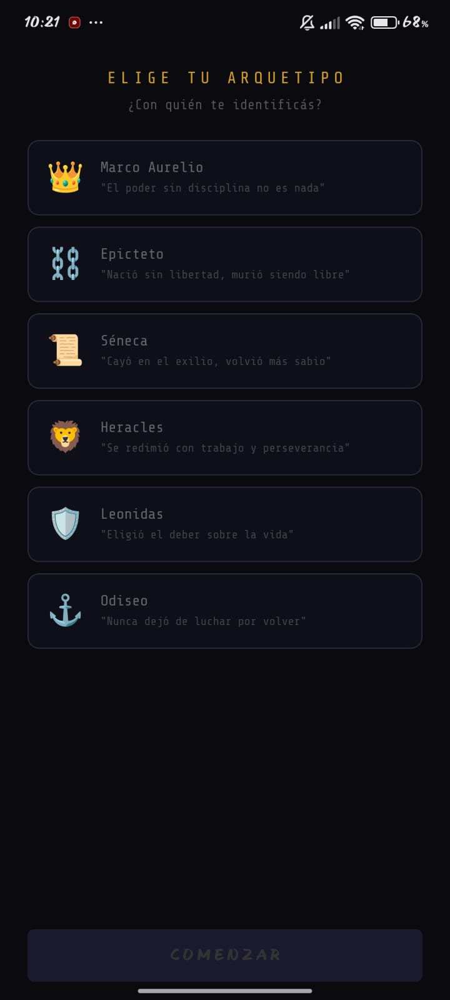
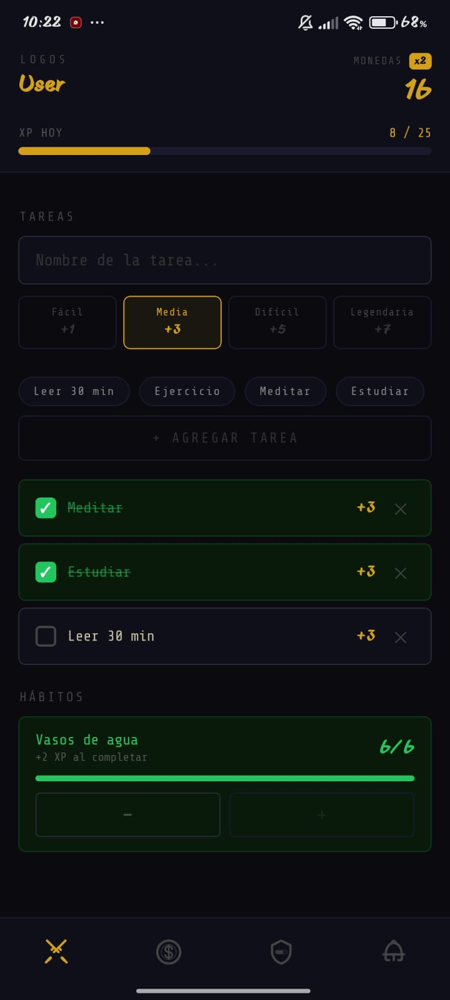
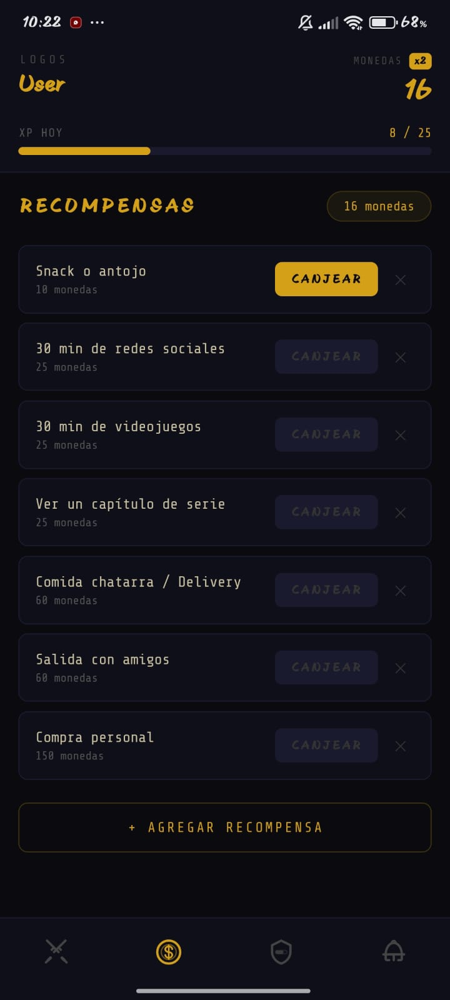
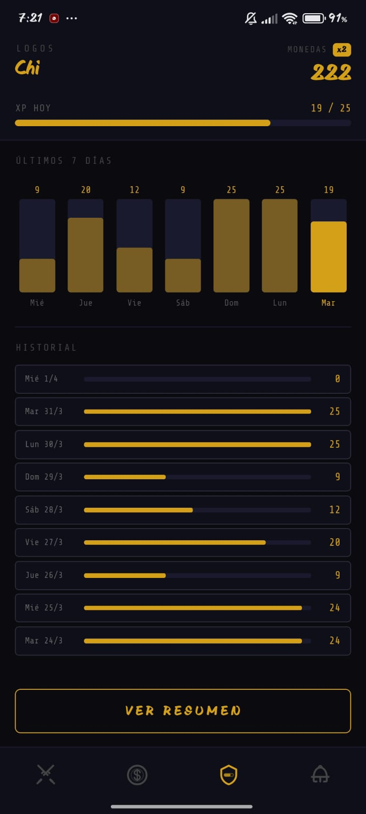
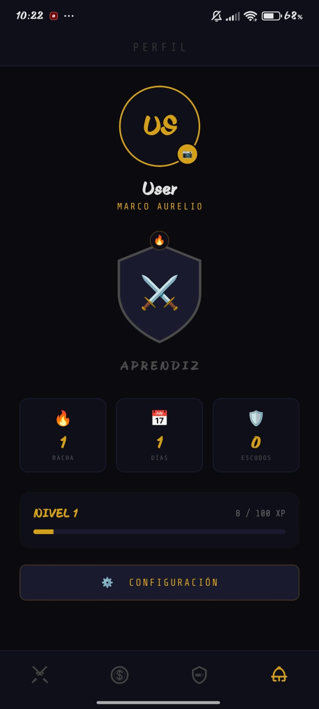

# ⚔️ LOGOS: Tu Entrenamiento Personal en la Vida Real

**LOGOS** es una aplicación de productividad gamificada diseñada para convertir tus metas diarias en una épica batalla por la auto-superación. Inspirada en la filosofía estoica y los sistemas RPG clásicos, transforma la gestión de tareas y hábitos en una experiencia de progreso constante.


---

## 🚀 Características Principales

### 🗡️ Gestión de Tareas (HOY)
- **Batallas Diarias**: Crea tareas con diferentes niveles de dificultad (Fácil, Media, Difícil, Legendaria).
- **Recompensa Inmediata**: Gana XP y monedas por cada victoria.
- **Sugerencias Rápidas**: Añade tareas comunes como "Meditar" o "Ejercicio" con un solo toque.
- **Historial dinámico**: Las tareas se desmarcan automáticamente cada nuevo día para una nueva oportunidad de victoria.

### 🔥 Forja de Hábitos
- **Consistencia**: Define hábitos de tipo contador (ej. 8 vasos de agua) o de tipo interruptor.
- **Progreso Visual**: Barras de progreso que te muestran qué tan cerca estás de completar tu disciplina diaria.
- **Acceso Directo**: Configura tus hábitos fácilmente desde el panel de perfil.

### 🛡️ Tienda de Recompensas
- **Gasta con Intención**: Compra recompensas que tú mismo defines.
- **Precios Simplificados**: Cuatro niveles de precio (Pequeño, Medio, Grande, Épico).
- **Recompensas Pre-cargadas**: Comienza con sugerencias equilibradas para hackear tu dopamina de forma saludable.

### 👑 Perfil y Progresión
- **Escudo Dinámico**: Tu escudo evoluciona (⚔️ → 🛡️ → 👑 → ⭐) según tu nivel global.
- **Racha Legendaria**: El color de tu marco cambia según tu racha de días activos (Gris, Verde, Azul, Púrpura, Dorado).
- **Avatar Personalizado**: Sube tu propia foto de guerrero.
- **Logros**: Gana insignias por consistencia y nivel.

---

## 📸 Galería de Interfaz

````carousel

<!-- slide -->

<!-- slide -->

<!-- slide -->

<!-- slide -->

<!-- slide -->

````

---

## 🛠️ Comenzar mi Camino

### 1. Clonar e Instalar
```bash
# Instalar dependencias
pnpm install
```

### 2. Ejecutar
```bash
# Iniciar servidor de desarrollo
pnpm start
```

### 3. Modos de Uso
- **Android/iOS**: Escanea el código QR con la app de Expo Go.
- **Web**: Presiona `w` en la terminal (soporte básico).

---

## ⚙️ Herramientas de Desarrollador
Para facilitar el testeo, LOGOS incluye un **Modo Dev** oculto:
1. Ve a la pantalla de **PERFIL**.
2. Toca el título **"PERFIL"** 5 veces seguidas.
3. El panel te permitirá simular el paso de días, forzar niveles y resetear datos para probar la lógica de reinicio.

---

## 🎨 Especificaciones de Diseño
- **Fondo**: `#0a0a0f` (Negro Profundo RPG).
- **Texto**: `#e2d9c5` (Papiro/Hueso).
- **Acento**: `#d4a017` (Oro LOGOS).
- **Tipografía**: *ShareTechMono* para un look retro-terminal.

---

*“Ninguna persona tiene el poder de tener todo lo que desea, pero está en su poder no desear lo que no tiene y aprovechar con alegría lo que tiene.” — Séneca*
